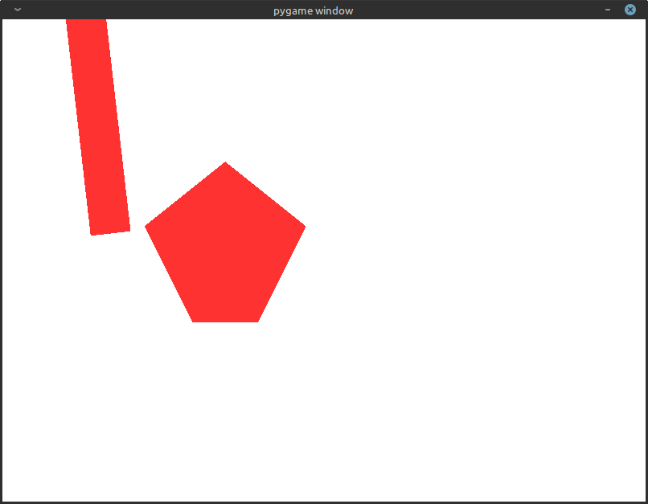
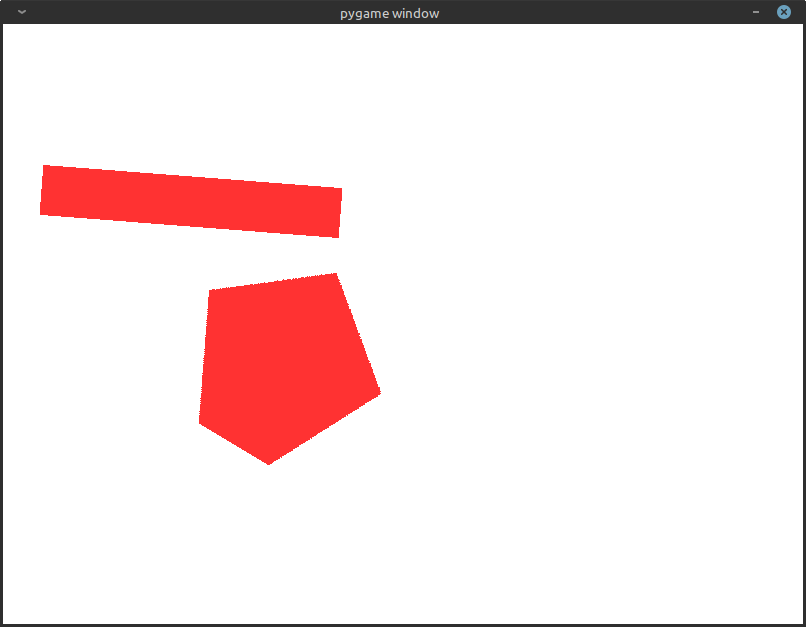
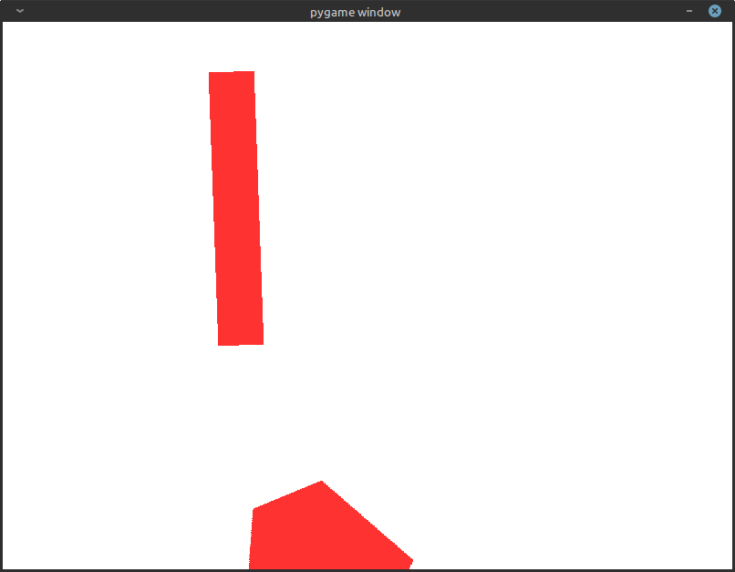

## TekPrototype

TekPrototype is a simple physics simulation that serves as a simplified version of my final project.

## Features

* Position, Velocity and Force/Acceleration simulated
* Rotation, Angular Velocity and Angular Acceleration
* Collision Detection
* Impulse-Based Collision Response

## Screenshots

